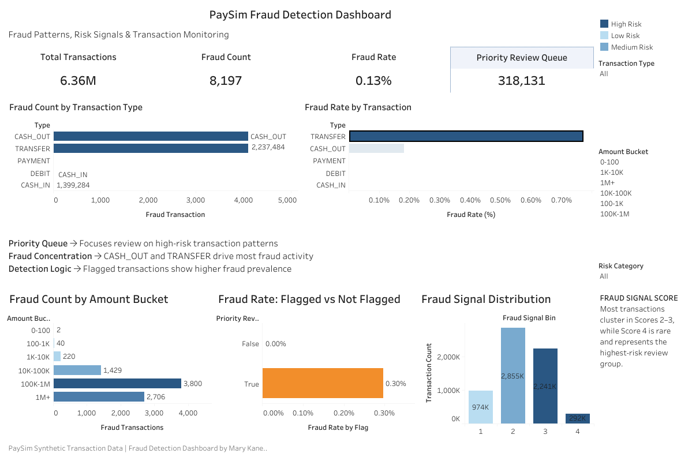

# paysim-fraud-risk-analysis
Fraud analysts need to identify suspicious transactions efficiently while minimizing investigation workload.
# PaySim Fraud Risk Analysis Dashboard

## Project Overview

This project analyzes synthetic financial transaction data to identify fraud patterns, prioritize high-risk transactions, and validate fraud detection logic.

The workflow follows a layered analytics approach:

* **Bronze Layer** → Raw transaction ingestion
* **Silver Layer** → Data cleaning, validation, and feature engineering
* **Gold Layer** → Business-ready fraud metrics and dashboard reporting

Built using:

* Python
* Pandas
* Tableau
* Fraud Signal Engineering
* Risk Segmentation

---

## Business Problem

Fraud analysts need to identify suspicious transactions efficiently while minimizing investigation workload.

This dashboard helps answer:

* Where fraud concentrates
* Which transactions are highest risk
* Whether detection rules are effective
* How transaction amount influences fraud

---

## Dataset

**PaySim** is a synthetic mobile money transaction dataset used to simulate fraud detection scenarios.

Dataset includes:

* Transaction Type
* Transaction Amount
* Account Balance Changes
* Fraud Labels (`isFraud`)
* Balance Mismatch Signals
* Transaction Risk Indicators

---

## Key Metrics

* **Total Transactions:** 6.36M
* **Fraud Transactions:** 8,213
* **Fraud Rate:** 0.13%
* **Priority Review Queue:** 318,131

---

## Dashboard Features

* Fraud Count by Transaction Type
* Fraud Rate by Transaction Type
* Fraud Count by Amount Bucket
* Fraud Signal Distribution
* Flagged vs Non-Flagged Fraud Comparison
* Interactive Filters

---

## Fraud Logic

The **Priority Review Queue** identifies transactions matching both conditions:

```text
Large Transaction Flag = TRUE
AND
Destination Balance Mismatch = TRUE
```

This creates a focused review queue that helps fraud analysts prioritize suspicious activity.

---

## Key Findings

* Fraud is concentrated in **CASH_OUT** and **TRANSFER** transactions
* Fraud rates increase with larger transaction values
* Flagged transactions show significantly higher fraud prevalence
* Fraud signal scores cluster in mid-range groups, while high-risk scores occur less frequently
* Priority Review Queue helps isolate transactions that warrant investigation

---

## Dashboard Preview

*Add your dashboard screenshot here.*

Example:

```markdown
```

---

## Tools Used

* Python
* Pandas
* Tableau
* Jupyter Notebook
* Data Visualization
* Fraud Analytics

---

## Author

**Mary Kane**
Fraud Analytics | Data Analytics | Tableau | Python | SQL

GitHub: [https://github.com/mkane00](https://github.com/mkane00)

---

## Tableau Dashboard

*Add your Tableau Public dashboard link here after publishing.*

Example:

```text
https://public.tableau.com/views/YourDashboardName
```
